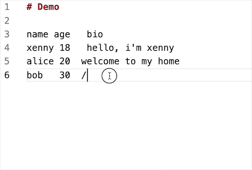
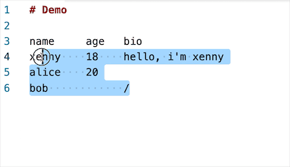

# markdown-table

Markdown table transform extension for Visual Studio Code.

## Functions

1. Convert to markdown table format by `split`.

    This module will select the minimum number of columns in all rows, then split on spaces or tab character for conversion.

    

2. Convert to markdown table format by `align`.

    This module will be divided according to the left alignment.

    It allows empty cells, but other positions must be left aligned.

    